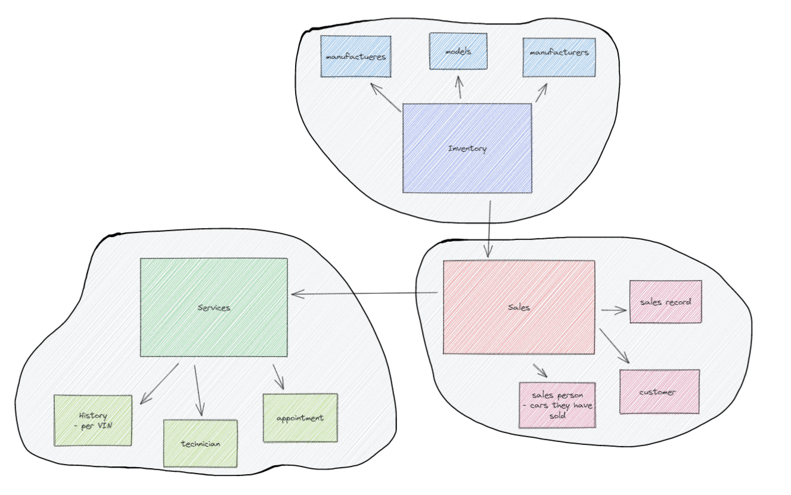

# CarCar

Team:

* Steve - Sales
* Robbie - Service
  

## Starting the project
 - Fork and clone the gitlab repo into our machines locally
 - We decided to work in the main branch only, being careful with our pushes.

## Design
CarCar is broken up into three domains:

* Inventory
* Services
* Sales

 *Diagram For Project*

## Setup
- Clone the repo
- Open in Visual Studio Code
- While in the top level directory /project-beta
  - run these commands
    - docker volume create beta-data
    - docker-compose build
    - docker-compose up
  - check your docker desktop to ensure sure all containers are running
- go to "localhost:3000"

## Service microservice

  - Contains 3 models, technician, appointment, and a automobile (has a history and VIN, comes from inventory)
  - Technicians contain a name and employee number attribute.
  - Appointments have a VIN number, customer name, date and time of appointment, reason, a complete/incomplete boolean field, a VIP boolean field (dependent on where the car was purchased), and foreign key relationship with a Technician.
  - Users have the option to create, update, delete, and view specific appointments along with a list of all scheulded appointments.
  - CarVO (value object) contains the vehincle VIN number, data is retrieved from the Automobile model in the Inventory microservice via a polling function.
  - Retrieved VIN is used to determine the VIP status

##### Sales microservice

#### Models
 Customer, Salesperson, Salesrecord, and AutomobileVO would have to be modeled in order to establish data relationships.

## Customer Model
  The customer model has a one to many relationship to the Salesperson model beause 1 person can buy cars from many different salespersons. Besides that relationship, the customer model is self-contained holding the customer's Name, Address, and Phone number

## Salesperson
  The salesperson has a many-to-many relationship with the salesrecord model because multiple salespersons can have multiple sales with a record attached. Salesrecords has to be the aggregate root as it combined all of the information from all the other API's. 

## AutomobileVO
  There are 2 things that I want to poll for with the AutomobileVO. I want the sold status of the vehicle in the inventory and the VIN(unique identifier) of the vehicle. when a salesrecord is created it will check to see if the car(identified by the VIN) has been sold or not.

## Salesrecord
  The salesrecord model contains 4 fields:

- Saleperson - ForeignKey
- Customer - ForeignKey
- Automobile - ForeignKey
- Price

